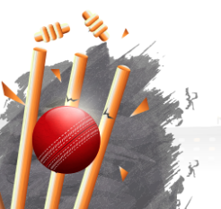

# Turn, Twist, Swing & Spin Analytic data workloads using Apache Spark





## 

## Can I become who I want to be?

Becoming a super hero is a fairly straight forward process:

That's a tough question but thankfully, our team is on it. Please bear with us while we're investigating.

```
$ give me super-powe
```

## Have you had a chance to answer the previous question?


 Super-powers are granted randomly so please submit an issue if you're not happy with yours.


Yes, after a few months we finally found the answer. Sadly, Mike is on vacations right now so I'm afraid we are not able to provide the answer at this point.


Once you're strong enough, save the world:


```bash
# Ain't no code for that yet, sorry
echo 'You got to trust me on this, I saved the world'
```


