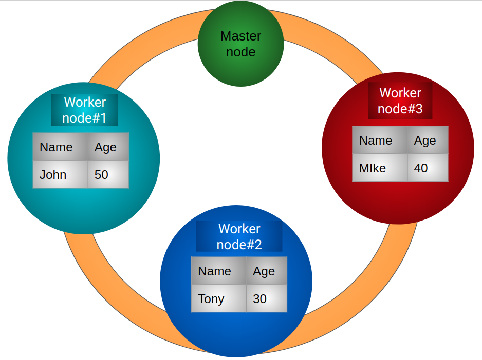

# Creating a Data Frame

## What is a Spark DataFrame?

**DataFrame** is a distributed collection of data organized into named columns. **DataFrames** can be constructed from a wide array of sources such as: structured data files, tables in Hive, external databases, or existing RDD, Lists, Pandas data frame.

Below is an example of how data is stored in distributed across 3 nodes. In this example, table consisting of 2 columns\(Name & Age\) and 3 rows are stored across worker nodes \(Assumption with replication factor of 1\). 

In spark, data operations are mostly carried out directly on a node where data resides instead of getting the data from other nodes.  

## Overview of how data is stored on a spark cluster

