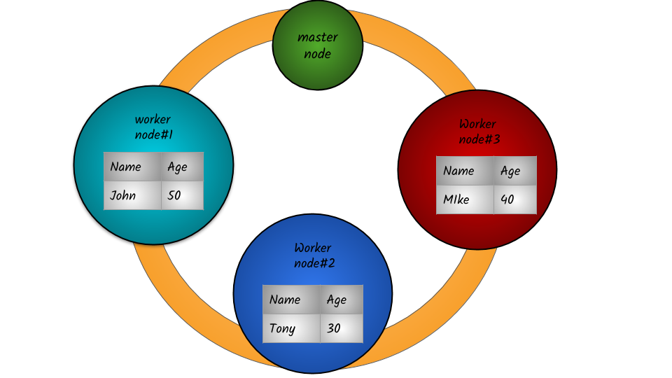

# Creating a Data Frame

## What is a Spark Data frame?

**Data Frame** is a distributed collection of data organized into named columns. **Data Frames** can be constructed from a wide array of sources such as: structured data files, tables in Hive, external databases, or existing RDD, Lists, Pandas data frame.

Below is an example of how data is distributed across 3 nodes. In this example, table consisting of 2 columns\(Name & Age\) and 3 rows are stored across worker nodes .  Each node stores one record.

In spark, data operations are mostly carried out directly on a node where data resides instead of getting the data from other nodes.        

                                                                                                  

## Overview of how data is stored on a spark cluster

## How to create a dataframe?


Syntax:     `createDataFrame`\(_data_, _schema=None_, _samplingRatio=None_, _verifySchema=True_\)                                                                                                                                               Creates a [`DataFrame`](http://spark.apache.org/docs/latest/api/python/pyspark.sql.html?highlight=createdata#pyspark.sql.DataFrame) from an `RDD`, a list or a `pandas.DataFrame`.                                          When `schema` is a list of column names, the type of each column will be inferred from `data.`When `schema` is `None`, it will try to infer the schema \(column names and types\) from `data`, which should be an RDD of either [`Row`](http://spark.apache.org/docs/latest/api/python/pyspark.sql.html?highlight=createdata#pyspark.sql.Row), `namedtuple`, or `dict`.                                               When `schema` is [`pyspark.sql.types.DataType`](http://spark.apache.org/docs/latest/api/python/pyspark.sql.html?highlight=createdata#pyspark.sql.types.DataType) or a datatype string, it must match the real data, or an exception will be thrown at runtime.                                                                                                            If the given schema is not [`pyspark.sql.types.StructType`](http://spark.apache.org/docs/latest/api/python/pyspark.sql.html?highlight=createdata#pyspark.sql.types.StructType), it will be wrapped into a [`pyspark.sql.types.StructType`](http://spark.apache.org/docs/latest/api/python/pyspark.sql.html?highlight=createdata#pyspark.sql.types.StructType) as its only field, and the field name will be “value”. Each record will also be wrapped into a tuple, which can be converted to row later.








