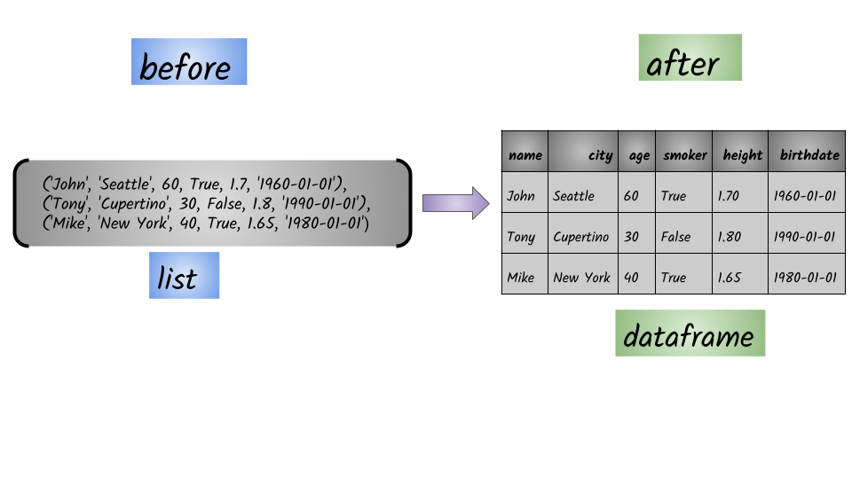

# From a list

## Goal:



## 1. Input: List

```python
[('John', 'Seattle', 60, True, 1.7, '1960-01-01'),
 ('Tony', 'Cupertino', 30, False, 1.8, '1990-01-01'),
 ('Mike', 'New York', 40, True, 1.65, '1980-01-01')]
```

## 2. Code: 

```python
spark.createDataFrame([('John', 'Seattle', 60, True, 1.7, '1960-01-01'), 
('Tony', 'Cupertino', 30, False, 1.8, '1990-01-01'), 
('Mike', 'New York', 40, True, 1.65, '1980-01-01')]).show()
```

## 3. Output: Spark Data Frame

```python
+----+---------+---+-----+----+----------+
|  _1|       _2| _3|   _4|  _5|        _6|
+----+---------+---+-----+----+----------+
|John|  Seattle| 60| true| 1.7|1960-01-01|
|Tony|Cupertino| 30|false| 1.8|1990-01-01|
|Mike| New York| 40| true|1.65|1980-01-01|
+----+---------+---+-----+----+----------+
```


Syntax: `createDataFrame`\(_data_, _schema=None_, _samplingRatio=None_, _verifySchema=True_\)


