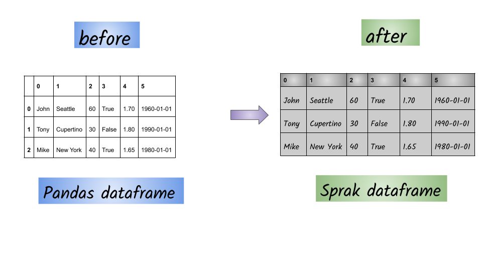

# From a Pandas data frame

## Goal:



## 1. Creating  a Pandas data frame

```python
import pandas as pd
df_pandas = pd.DataFrame([('John', 'Seattle', 60, True, 1.7, '1960-01-01'),
 ('Tony', 'Cupertino', 30, False, 1.8, '1990-01-01'),
 ('Mike', 'New York', 40, True, 1.65, '1980-01-01')])
```

## Input: Pandas data frame

```python
	 0	     1	    2	   3	   4	      5
0	John	Seattle	  60	True	1.70	1960-01-01
1	Tony	Cupertino	30	False	1.80	1990-01-01
2	Mike	New York	40	True	1.65	1980-01-01
```

## 2. Code: 

```python
spark.createDataFrame(df_pandas).show()
```

## 3. Output:

```python
+----+---------+---+-----+----+----------+
|   0|        1|  2|    3|   4|         5|
+----+---------+---+-----+----+----------+
|John|  Seattle| 60| true| 1.7|1960-01-01|
|Tony|Cupertino| 30|false| 1.8|1990-01-01|
|Mike| New York| 40| true|1.65|1980-01-01|
+----+---------+---+-----+----+----------+
```

