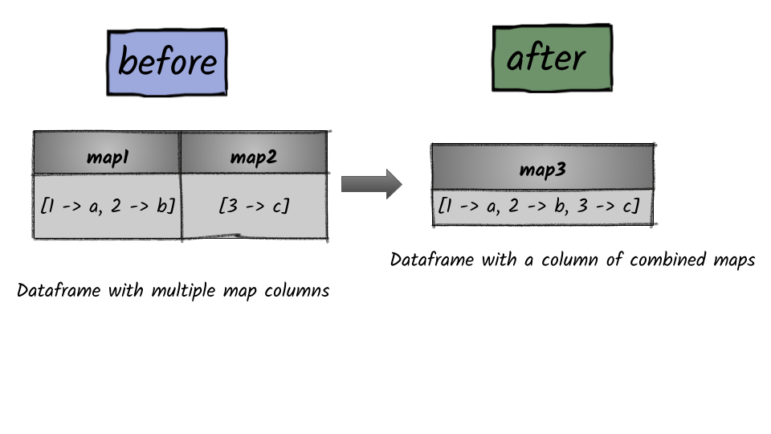

# How to combine multiple map columns into one?



## 1.  Input:  Spark dataframe containing multiple map columns

```python
df = spark.sql("SELECT map(1, 'a', 2, 'b') as map1, map(3, 'c') as map2")
df.show()
+----------------+--------+
|            map1|    map2|
+----------------+--------+
|[1 -> a, 2 -> b]|[3 -> c]|
+----------------+--------+
```

## 2.  Output: Spark dataframe containing an array

```python
from pyspark.sql.functions import map_concat
df = df.select(map_concat("map1", "map2").alias("map3"))
df.show(truncate=False)
+------------------------+
|map3                    |
+------------------------+
|[1 -> a, 2 -> b, 3 -> c]|
+------------------------+
```

