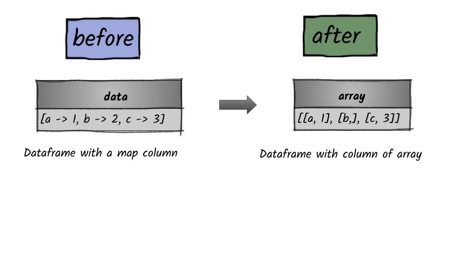

# How to convert a map column into an array column?




## 1.  Input:  Spark dataframe containing map column

```python
df = spark.createDataFrame([({"a":1,"b": 2,"c":3},)],["data"])
df.show(truncate=False)
+------------------------+
|data                    |
+------------------------+
|[a -> 1, b -> 2, c -> 3]|
+------------------------+
```

## 2.  Output: Spark dataframe containing an array

```python
from pyspark.sql.functions import map_entries
df = df.select(map_entries(df.data).alias("array")).show(truncate=False)
+----------------------+
|array                 |
+----------------------+
|[[a, 1], [b,], [c, 3]]|
+----------------------+
```


