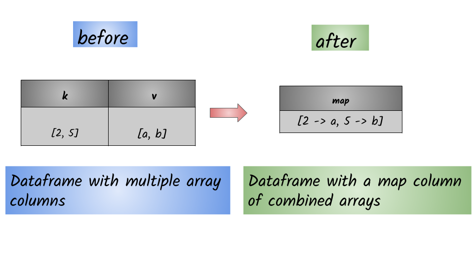

# How to create a map column from multiple array columns?




## 1.  `Input:  Spark dataframe containing map column`

```python
df = spark.createDataFrame([([2, 5], ['a', 'b'])], ['k', 'v'])
df.show()
+------+------+
|     k|     v|
+------+------+
|[2, 5]|[a, b]|
+------+------+
```

## 2.  Output: Spark dataframe containing an array

```python
from pyspark.sql.functions import map_from_arrays
df.select(map_from_arrays(df.k, df.v).alias("map")).show()
+----------------+
|             map|
+----------------+
|[2 -> a, 5 -> b]|
+----------------+
```

