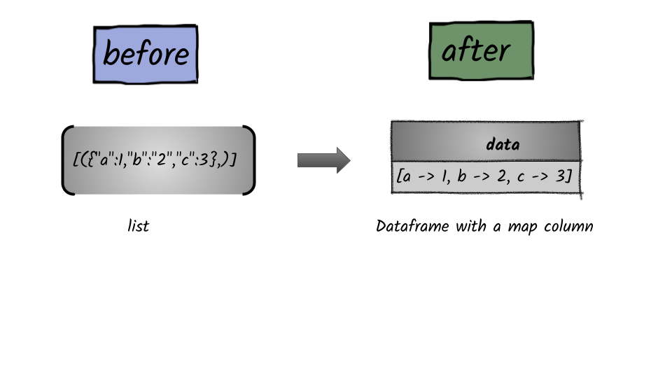

# How to create a column of map type?

## 



## 1.  Input:  List of dictionary 

```python
[({"a":1,"b":"2","c":3},)]
```

## 2.  Output: Spark dataframe containing map column

```python
df = spark.createDataFrame([({"a":1,"b": 2,"c":3},)],["data"])
df.show(truncate=False)
+------------------------+
|data                    |
+------------------------+
|[a -> 1, b -> 2, c -> 3]|
+------------------------+

df.dtypes
[('data', 'map<string,bigint>')]
```

