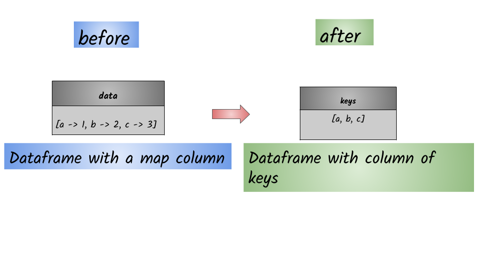

# How to extract the keys from a map column?



## 1.  Input:  Spark data frame consisting of a map column 

```python
df = spark.createDataFrame([({"a":1,"b":"2","c":3},)],["data"])
df.show(truncate=False)
+----------------------+
|data                  |
+----------------------+
|[a -> 1, b ->, c -> 3]|
+----------------------+
```

## 2.  Output: Spark data frame consisting of a column of keys

```python
from pyspark.sql.functions import map_keys
df.select(map_keys(df.data).alias("keys")).show()
+---------+
|     keys|
+---------+
|[a, b, c]|
+---------+
```


Syntax:  `map_keys`\(_col_\)                                                                                                                             Returns an unordered array containing the keys of the map


