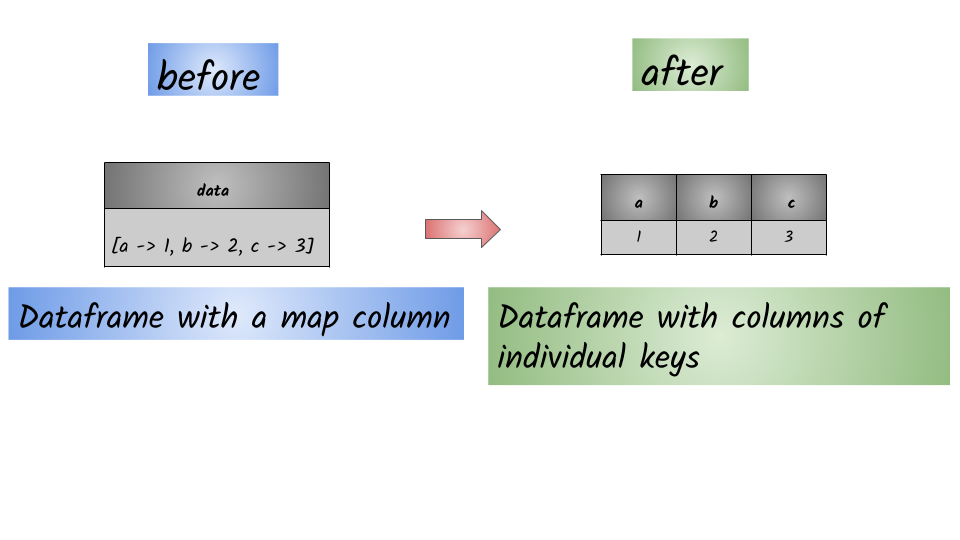

# How to read individual elements ?



## 1.  Input:  Spark dataframe containing map column

```python
df = spark.createDataFrame([({"a":1,"b": 2,"c":3},)],["data"])
df.show(truncate=False)
+------------------------+
|data                    |
+------------------------+
|[a -> 1, b -> 2, c -> 3]|
+------------------------+
```

## 2.  Output: Spark dataframe containing map column

```python
df.select(df.data.a.alias("a"), df.data.b.alias("b"), df.data.c.alias("c") ).show()
+---+---+---+
|  a|  b|  c|
+---+---+---+
|  1|  2|  3|
+---+---+---+
```

