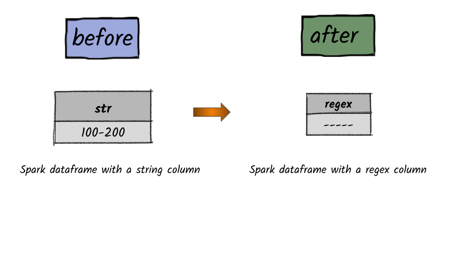

# How to replace a specific group matched by a Java regex?



## 1.  Input:  Spark data frame consisting of a column having a string

```python
df = spark.createDataFrame([('100-200',)], ['string'])
df.show()
+-------+
| string|
+-------+
|100-200|
+-------+
```

## 2.  Output

```python
from pyspark.sql.functions import regexp_replace
df.select(regexp_replace('string', r'(\d+)', '--').alias('replace')).show()
+-------+
|replace|
+-------+
|  -----|
+-------+
```


**Syntax:**   `regexp_extract`\(_str_, _pattern_, _idx_\)                                                                                                                 Extract a specific group matched by a Java regex, from the specified string column. If the regex did not match, or the specified group did not match, an empty string is returned.                


