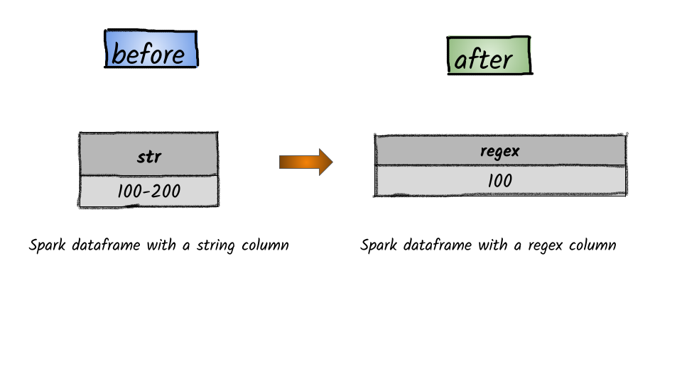

# How to extract a specific group matched by a Java regex?



## 1.  Input:  Spark dataframe with a string column

```python
df = spark.createDataFrame([('100-200',)], ['str'])
df.show()
+-------+
|    str|
+-------+
|100-200|
+-------+
```

## 2.  Output

```python
from pyspark.sql.functions import regexp_extract
df.select(regexp_extract('str', r'(\d+)-(\d+)', 1).alias('regex')).show()
+-----+
|regex|
+-----+
|  100|
+-----+
```


**Syntax:**   `egexp_extract`\(_str_, _pattern_, _idx_\)                                                                                                                 Extract a specific group matched by a Java regex, from the specified string column. If the regex did not match, or the specified group did not match, an empty string is returned.          


