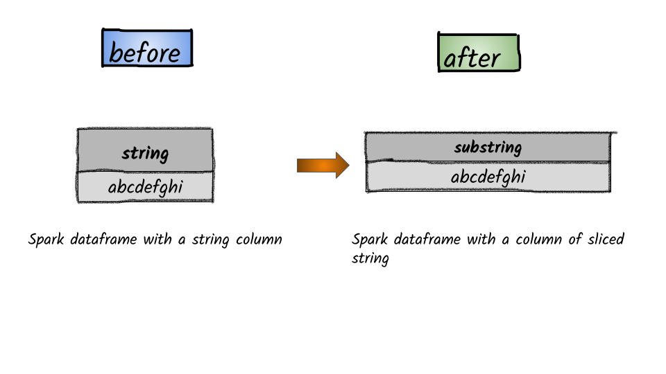

# How to slice  string?



## 1.  Input:  Spark dataframe with a column having a string

```python
df = spark.createDataFrame([('abcdefghi',)], ['string',])
df.show()
+---------+
|   string|
+---------+
|abcdefghi|
+---------+
```

## 2.  Output

```python
from pyspark.sql.functions import substring
df.select(substring(df.string,1,4).alias('substring')).show()
+---------+
|substring|
+---------+
|     abcd|
+---------+

```


**Syntax:**    `substring`\(_str_, _pos_, _len_\)                                                                                                                 Substring starts at pos and is of length len when str is String type or returns the slice of byte array that starts at pos in byte and is of length len when str is Binary type.             



## 1.  Input:  Spark data frame consisting of a column having a string

```python
df = spark.createDataFrame([('abc__def__ghc',)], ['string',])
df.show()
+-------------+
|       string|
+-------------+
|abc__def__ghc|
+-------------+
```

## 2.  Output

```python
from pyspark.sql.functions import substring_index
df.select(substring_index(df.string,'__',2).alias('substringindex')).show()
+--------------+
|substringindex|
+--------------+
|      abc__def|
+--------------+
```


**Syntax:**    `substring_index`\(_str_, _delim_, _count_\)                                                                           Returns the substring from string str before count occurrences of the delimiter delim. If count is positive, everything the left of the final delimiter \(counting from left\) is returned. If count is negative, every to the right of the final delimiter \(counting from the right\) is returned. substring\_index performs a case-sensitive match when searching for delim.                                                                                                             


