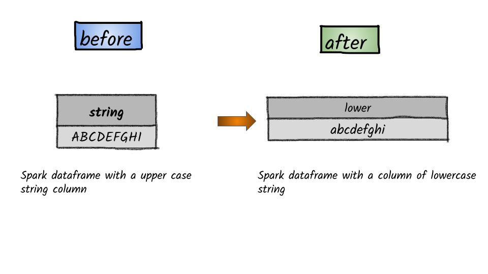

# How to convert to lowercase?



## 1.  Input:  Spark dataframe with a column having a string

```python
df = spark.createDataFrame([('ABCDEFGHI',)], ['string',])
df.show()
+---------+
|   string|
+---------+
|ABCDEFGHI|
+---------+
```

## 2.  Output

```python
from pyspark.sql.functions import lower
df.select(lower(df.string).alias('lower_string')).show()
+------------+
|lower_string|
+------------+
|   abcdefghi|
+------------+
```


**Syntax:**   `upper`\(_col_\)                                                                                                                                 Converts a string expression to upper case                                                                                                       


## 

