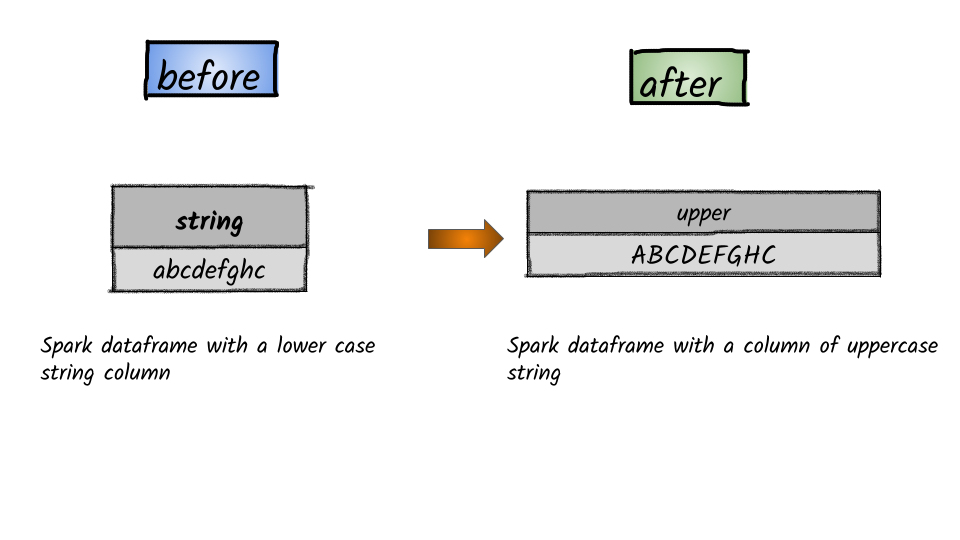

# How to convert to uppercase?



## 1.  Input:  Spark dataframe with a column having a string

```python
df = spark.createDataFrame([('abcdefghc',)], ['string',])
df.show()
+---------+
|   string|
+---------+
|abcdefghc|
+---------+
```

## 2.  Output

```python
from pyspark.sql.functions import upper
df.select(upper(df.string).alias('upper_string')).show()
+------------+
|upper_string|
+------------+
|   ABCDEFGHC|
+------------+
```


**Syntax:**   `upper`\(_col_\)                                                                                                                                 Converts a string expression to upper case                                                                                                       


