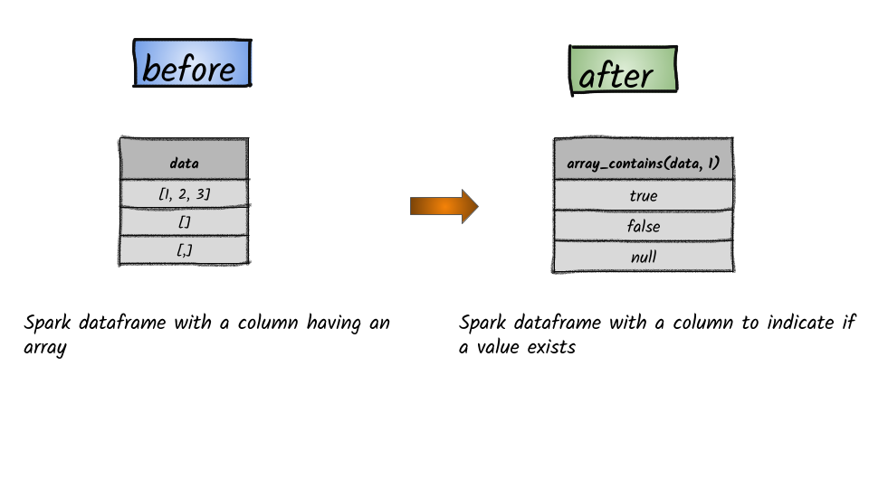

# How to check if a value is in an array column?



## 1.  Input:  Spark data frame consisting of a column having an array

```python
df = spark.createDataFrame([([1, 2, 3],), ([],),([None, None],)], ['data'])
df.show()
+---------+
|     data|
+---------+
|[1, 2, 3]|
|       []|
|      [,]|
+---------+
```


In the above data frame, first record is an array having 3 elements, second row is an empty array and third row is a null array.                                                                                                              Empty array is an array of length 0 . It has no elements.                                                                  Null Array consists of null elements\(None\)


## 2.  Output

```python
from pyspark.sql.functions import array_contains
df.select(array_contains(df.data, 1)).show()
+-----------------------+
|array_contains(data, 1)|
+-----------------------+
|                   true|
|                  false|
|                   null|
+-----------------------+
```


**Syntax:   array\_contains\(column,  value\)**                                                                                                        returns null if the array is null,                                                                                                                true if the array contains the given value,                                                                                            false otherwise                                                                                                                                


