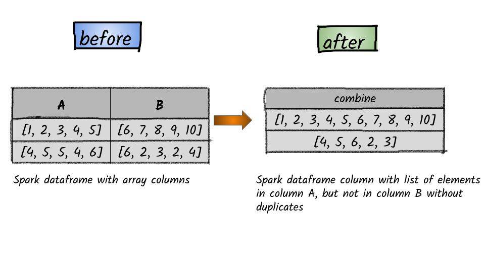

# How to combine the array elements from column A and column B, without duplicates?



## 1.  Input:  Spark data frame with a columns of arrays

```python
df = spark.createDataFrame([([1, 2, 3, 4, 5],[6, 7, 8, 9, 10]), ([4, 5, 5, 4, 6],[6, 2, 3, 2, 4])], ['A', 'B'])
df.show()
+---------------+----------------+
|              A|               B|
+---------------+----------------+
|[1, 2, 3, 4, 5]|[6, 7, 8, 9, 10]|
|[4, 5, 5, 4, 6]| [6, 2, 3, 2, 4]|
+---------------+----------------+
```

## 2. Output

```python
from pyspark.sql.functions import array_union
df.select(array_union(df.A, df.B).alias('combine')).show(truncate=False)
+-------------------------------+
|combine                           |
+-------------------------------+
|[1, 2, 3, 4, 5, 6, 7, 8, 9, 10]|
|[4, 5, 6, 2, 3]                |
+-------------------------------+
```


**Syntax:**   `array_union`\(_col1_, _col2_\)                ****                                                                                                      returns an array of the elements in the union of col1 and col2, without duplicates.

* **col1** – name of column containing array
* **col2** – name of column containing array                                                                                          


## 

