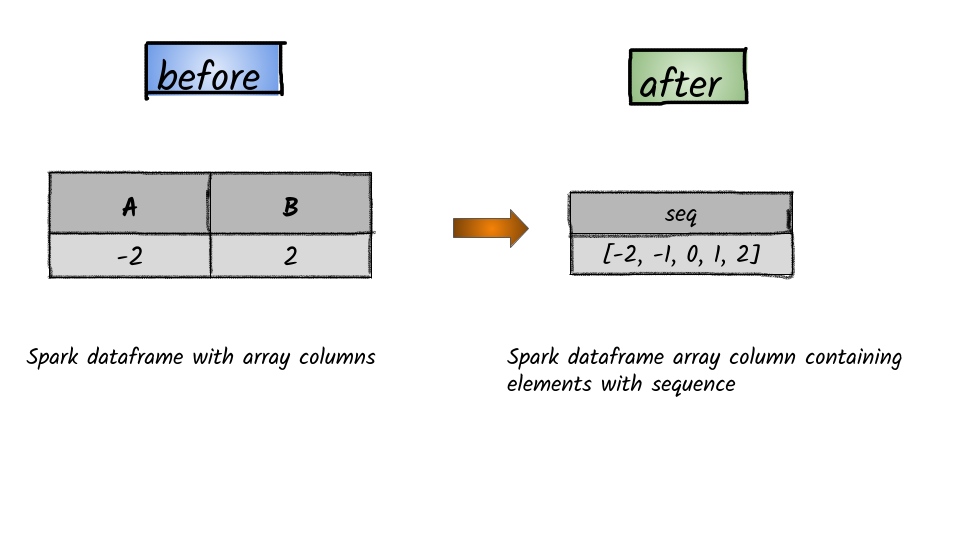

# How to create a  array column  containing elements with sequence\(start,stop,step\)?



## 1.  Input:  Spark dataframe with a  column having an array

```python
df = spark.createDataFrame([(-2, 2)], ('A', 'B'))
df.show()
+---+---+
|  A|  B|
+---+---+
| -2|  2|
+---+---+
```

## 2.  Output

```python
from pyspark.sql.functions import sequence
df.select(sequence('A', 'B').alias('seq')).show()
+-----------------+
|              seq|
+-----------------+
|[-2, -1, 0, 1, 2]|
+-----------------+
```


**Syntax:**   `sequence`\(_start_, _stop_, _step=None_\)                                                                                                                 Generates an array of elements from start to stop \(inclusive\), incrementing by step. The type of the returned elements is the same as the type of argument expressions. Supported types are: byte, short, integer, long, date, timestamp. The start and stop expressions must resolve to the same type. If start and stop expressions resolve to the 'date' or 'timestamp' type then the step expression must resolve to the 'interval' type, otherwise to the same type as the start and stop expressions.                 


