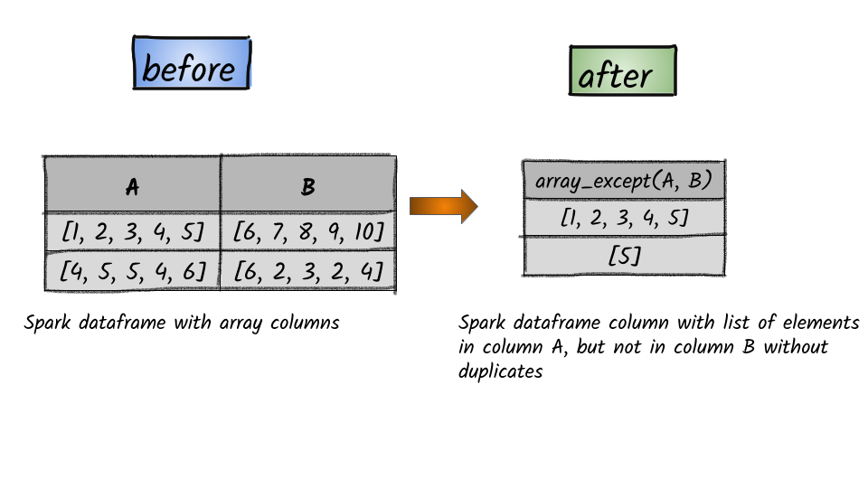

# How to find the list of elements in column A, but not in column B without duplicates?



## 1.  Input:  Spark dataframe with array columns  

```python
df = spark.createDataFrame([([1, 2, 3, 4, 5],[6, 7, 8, 9, 10]), ([4, 5, 5, 4, 6],[6, 2, 3, 2, 4])], ['A', 'B'])
df.show()
+---------------+----------------+
|              A|               B|
+---------------+----------------+
|[1, 2, 3, 4, 5]|[6, 7, 8, 9, 10]|
|[4, 5, 5, 4, 6]| [6, 2, 3, 2, 4]|
+---------------+----------------+
```


In the above data frame, there are 2 columns having an array.                                


## 2.  Output

```python
from pyspark.sql.functions import array_except
df.select(array_except(df.A, df.B)).show()
+------------------+
|array_except(A, B)|
+------------------+
|   [1, 2, 3, 4, 5]|
|               [5]|
+------------------+
```


**Syntax:**   `array_except`\(_col1_, _col2_\)                                                                                                  ****  returns an array of the elements in col1 but not in col2, without duplicates                                                                                                                                                                                                                                


