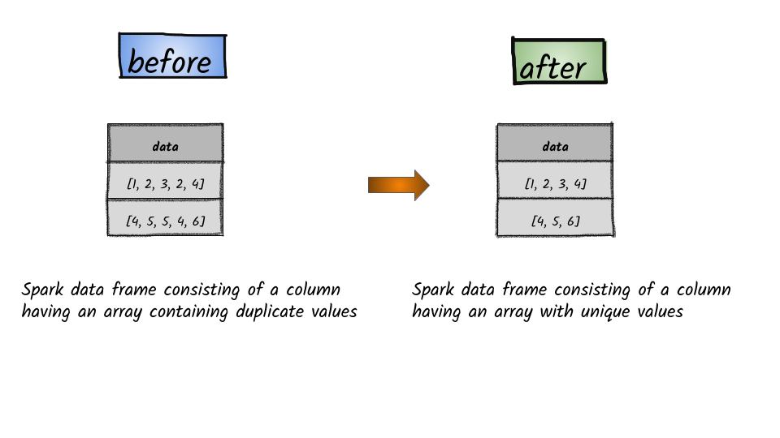

# How to remove duplicate values from an array column?



## 1.  Input:  Spark data frame consisting of a column having an array containing duplicate values

```python
df = spark.createDataFrame([([1, 2, 3, 2, 4],), ([4, 5, 5, 4, 6],)], ['data'])
df.show()
+---------------+
|           data|
+---------------+
|[1, 2, 3, 2, 4]|
|[4, 5, 5, 4, 6]|
+---------------+
```


In the above data frame, both first & second record contains an array having duplicates.                                


## 2.  Output : Spark data frame consisting of a column having an array with unique values

```python
from pyspark.sql.functions import array_distinct
df.select(array_distinct(df.data)).show()
+--------------------+
|array_distinct(data)|
+--------------------+
|        [1, 2, 3, 4]|
|           [4, 5, 6]|
+--------------------+
```


**Syntax:   array\_distinct\(column\_name\)**     removes duplicates  from the array in the column                                                                                                                                                                                                                                 



