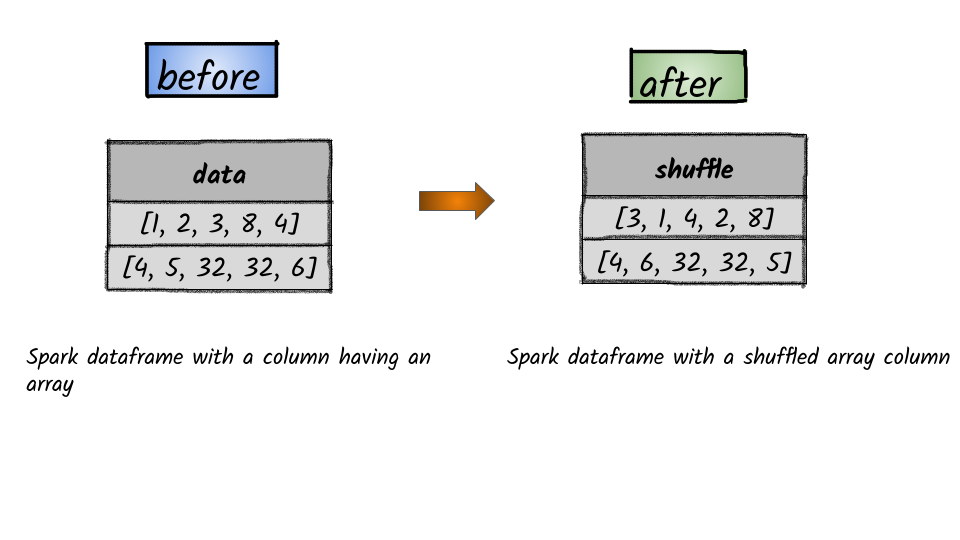

# How to shuffle a column containing an array?



## 1.  Input:  Spark dataframe with a column having an array

```python
df = spark.createDataFrame([([1, 2, 3, 8, 4],), ([4, 5, 32, 32, 6],)], ['data'])
df.show()
+-----------------+
|             data|
+-----------------+
|  [1, 2, 3, 8, 4]|
|[4, 5, 32, 32, 6]|
+-----------------+
```


I


## 2.  Output

```python
from pyspark.sql.functions import shuffle
df.select(shuffle(df.data).alias('shuffle')).show()
+-----------------+
|          shuffle|
+-----------------+
|  [3, 1, 4, 2, 8]|
|[4, 6, 32, 32, 5]|
+-----------------+
```


**Syntax:**   `shuffle`\(_col_\)                                                                                                                 Generates a random permutation of the given array               


