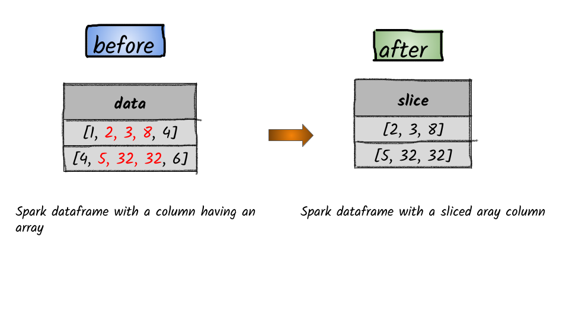

# How to slice an array in a column?



## 1.  Input:  Spark data frame consisting of a column having an array

```python
df = spark.createDataFrame([([1, 2, 3, 8, 4],), ([4, 5, 32, 32, 6],)], ['data'])
df.show()
+-----------------+
|             data|
+-----------------+
|  [1, 2, 3, 8, 4]|
|[4, 5, 32, 32, 6]|
+-----------------+
```


I


## 2.  Output

```python
from pyspark.sql.functions import slice
df.select(slice(df.data, 2, 3).alias('slice')).show()
+-----------+
|      slice|
+-----------+
|  [2, 3, 8]|
|[5, 32, 32]|
+-----------+
```


**Syntax:**   `slice`\(_x_, _start_, _length_\)                                                                                                                 returns an array containing all the elements in x from index start \(array indices start at 1, or from the end if start is negative\) with the specified length                                                     

* **x** – the array to be sliced
* **start** – the starting index
* **length** – the length of the slice               


