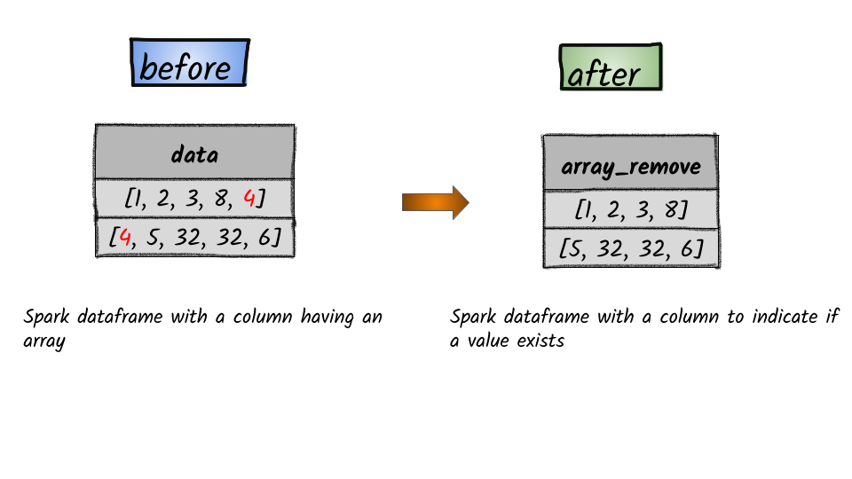

# How to remove all elements equal to an element from the given array in a column?



## 1.  Input:  Spark dataframe with a column having an array

```python
df = spark.createDataFrame([([1, 2, 3, 8, 4],), ([4, 5, 32, 32, 6],)], ['data'])
df.show()
+-----------------+
|             data|
+-----------------+
|  [1, 2, 3, 8, 4]|
|[4, 5, 32, 32, 6]|
+-----------------+
```


In


## 2.  Output

```python
from pyspark.sql.functions import array_remove
df.select(array_remove(df.data, 4).alias("array_remove")).show()
+--------------+
|  array_remove|
+--------------+
|  [1, 2, 3, 8]|
|[5, 32, 32, 6]|
+--------------+
```


**Syntax:**   `array_remove`\(_col_, _element_\)  ****                                                                                                      Remove all elements that equal to element from the given array.                                                                                                   

* **col** – name of column containing array
* **element** – element to be removed from the array                                                                                                                           


