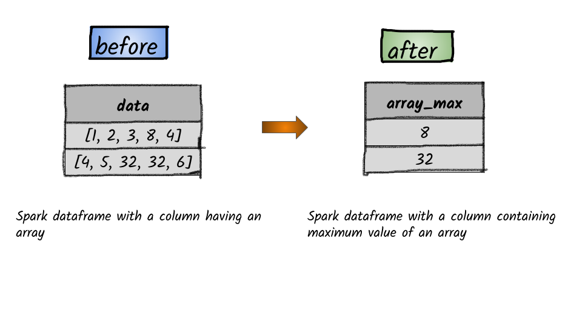

# How to find the maximum value of an array in a column?



## 1.  Input:  Spark dataframe with a column having an array

```python
df = spark.createDataFrame([([1, 2, 3, 8, 4],), ([4, 5, 32, 32, 6],)], ['data'])
df.show()
+-----------------+
|             data|
+-----------------+
|  [1, 2, 3, 8, 4]|
|[4, 5, 32, 32, 6]|
+-----------------+
```


I


## 2.  Output

```python
from pyspark.sql.functions import array_max
df.select(array_max(df.data).alias("array_max")).show()
+---------+
|array_max|
+---------+
|        8|
|       32|
+---------+
```


**Syntax:**  `array_min`\(_col_\)                                                                                                                 returns the minimum value of the array                                                                                                                                                                                                                                                       


