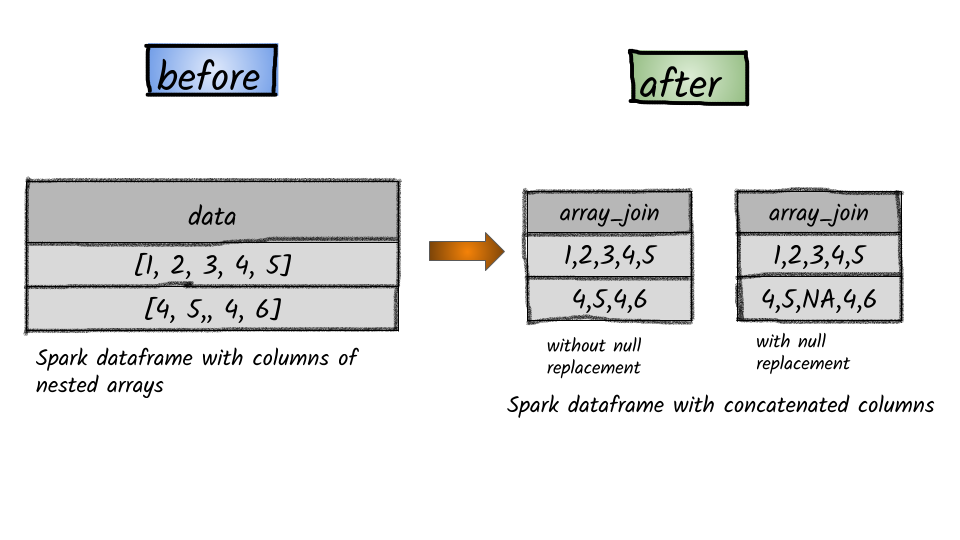

# How to concatenate the elements of an array in a column?



## 1.  Input:  Spark data frame with a column having an array

```python
df = spark.createDataFrame([([1, 2, 3, 4, 5],), ([4, 5, None, 4, 6],)], ['A'])
df.show()
+---------------+
|              A|
+---------------+
|[1, 2, 3, 4, 5]|
|  [4, 5,, 4, 6]|
+---------------+
```

## 2.  Output

```python
from pyspark.sql.functions import array_join
df.select(array_join(df.A,',').alias("array_join")).show()
+----------+
|array_join|
+----------+
| 1,2,3,4,5|
|   4,5,4,6|
+----------+
```

```python
df.select(array_join(df.A,',', null_replacement="NA").alias("array_join")).show()
+----------+
|array_join|
+----------+
| 1,2,3,4,5|
|4,5,NA,4,6|
+----------+
```


**Syntax:**   `array_join`\(_col_, _delimiter_, _null\_replacement=None_\)                                                                                                      Concatenates the elements of column using the delimiter. Null values are replaced with null\_replacement if set, otherwise they are ignored.                                                                                                 


```

```

