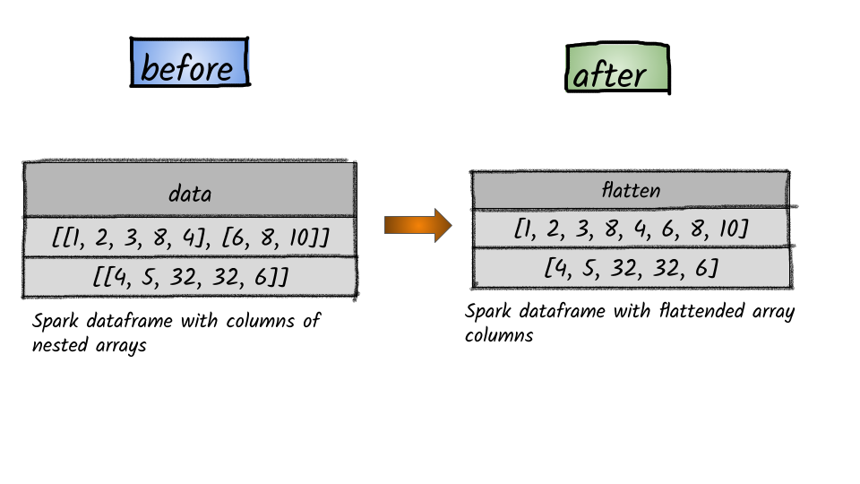

# How to flatten a column containing nested arrays?



## 1.  Input:  Spark dataframe with columns of nested arrays

```python
df = spark.createDataFrame([([[1, 2, 3, 8, 4],[6,8, 10]],), ([[4, 5, 32, 32, 6]],)], ['data'])
df.show(truncate=False)
+-----------------------------+
|data                         |
+-----------------------------+
|[[1, 2, 3, 8, 4], [6, 8, 10]]|
|[[4, 5, 32, 32, 6]]          |
+-----------------------------+
```

## 2. Output

```python
from pyspark.sql.functions import flatten
df.select(flatten(df.data).alias('flatten')).show(truncate=False)
+-------------------------+
|flatten                  |
+-------------------------+
|[1, 2, 3, 8, 4, 6, 8, 10]|
|[4, 5, 32, 32, 6]        |
+-------------------------+
```


**Syntax:**   `flatten`\(_col_\)                ****                                                                                                      creates a single array from an array of arrays. If a structure of nested arrays is deeper than two levels, only one level of nesting is removed.                                                                                         **col** – name of column or expression                  


