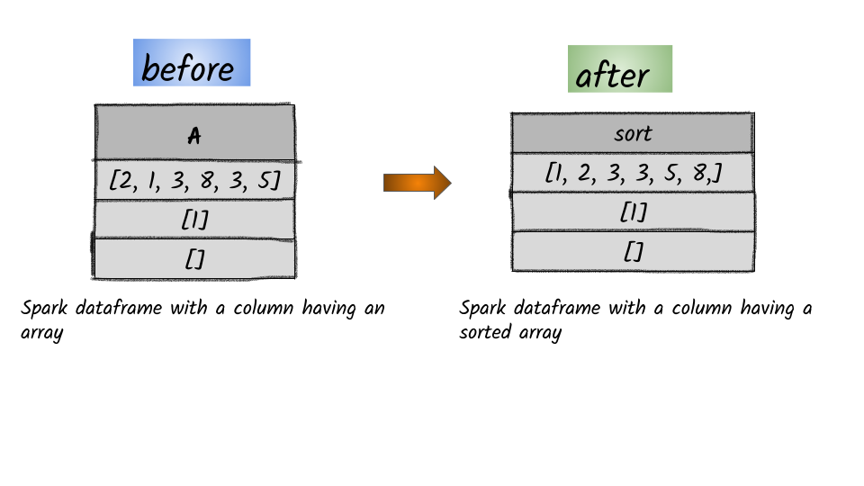

# How to sort the column array in ascending order?



## 1.  Input:  Spark dataframe with a column having an array

```python
df = spark.createDataFrame([([2, 1, None, 3, 8, 3, 5],),([1],),([],)], ['data'])
df.show()
+-------------------+
|               data|
+-------------------+
|[2, 1,, 3, 8, 3, 5]|
|                [1]|
|                 []|
+-------------------+
```


In 


## 2.  Output

```python
from pyspark.sql.functions import array_sort
df.select(array_sort(df.data).alias('sort')).show()
+-------------------+
|               sort|
+-------------------+
|[1, 2, 3, 3, 5, 8,]|
|                [1]|
|                 []|
+-------------------+
```


**Syntax:**   `array_sort`\(_col_\)                                                                                                                  sorts the input array in ascending order                                                                                                


