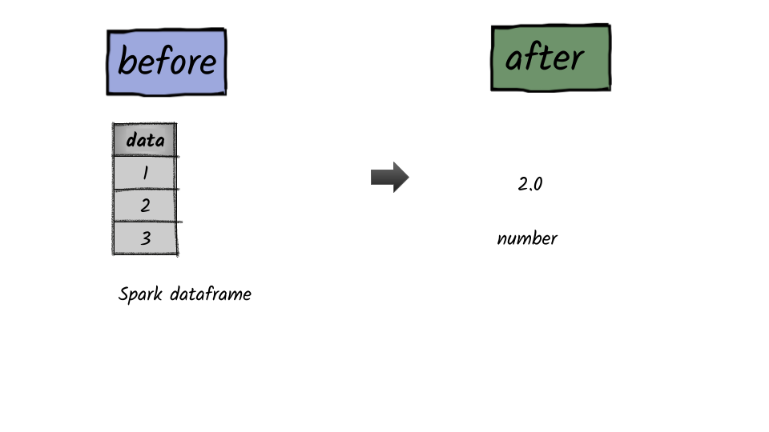

# How to calculate the mean of a column?



## 1.  Input:  Spark data frame with a column having numbers

```python
df = spark.createDataFrame([(1,),(2,),(3,)],['data'])
df.show()
+----+
|data|
+----+
|   1|
|   2|
|   3|
+----+
```

## 2.  Output

```python
from pyspark.sql.functions import mean
df.select(mean(df.data)).first()[0]
2.0
```


**Syntax:**   `mean`\(_col_\)

returns the average of the values in a group.                                                                                                          


     

