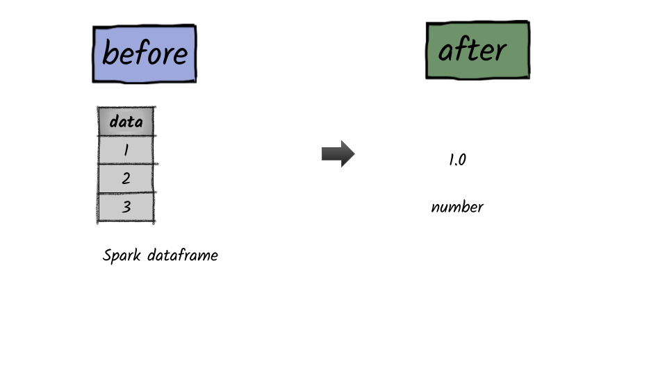

# How to calculate the standard deviation of a column?



## 1.  Input:  Spark data frame with a column having numbers

```python
df = spark.createDataFrame([(1,),(2,),(3,)],['data'])
df.show()
+----+
|data|
+----+
|   1|
|   2|
|   3|
+----+
```

## 2.  Output

```python
from pyspark.sql.functions import stddev
df.select(stddev(df.data).alias('mean')).first()[0]
1.0
```


**Syntax:   stddev**\(_col_\)

returns the standard deviation of the values in a group.      


## 

