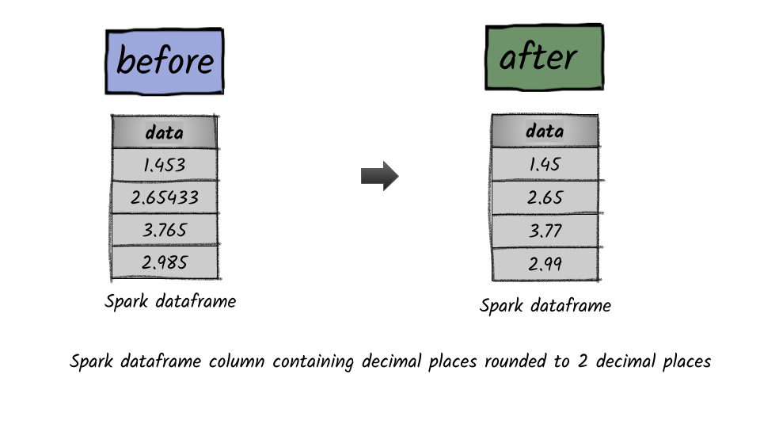

# How to round values in a column?




## 1.  Input:  Spark data frame with a column having numbers

```python
df = spark.createDataFrame([(1.453,),(2.65433,),(3.765,),(2.985,)],['data'])
df.show()
+-------+
|   data|
+-------+
|  1.453|
|2.65433|
|  3.765|
|  2.985|
+-------+
```

## 2.  Output

```python
from pyspark.sql.functions import round
df.select(round(df.data,2)).show()
+--------------+
|round(data, 2)|
+--------------+
|          1.45|
|          2.65|
|          3.77|
|          2.99|
+--------------+
```


**Syntax:**   `round`\(_col_, _scale=0_\)

Round the given value to scale decimal places using HALF\_UP rounding mode if scale &gt;= 0 or at integral part when scale &lt; 0  


## 

