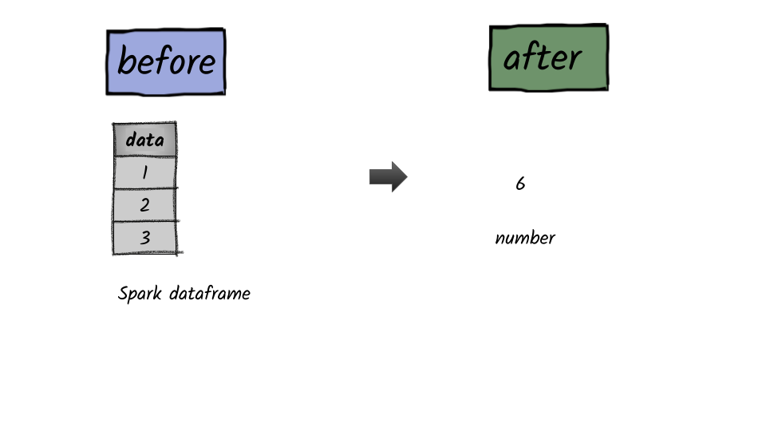

# How to calculate the sum of a column?




## Example 1. 

```python
#INPUT

df = spark.createDataFrame([(1,),(2,),(3,)],['data'])
df.show()
+----+
|data|
+----+
|   1|
|   2|
|   3|
+----+

# OUTPUT
from pyspark.sql.functions import sum
df.select(sum(df.data)).first()[0]
6
```


**Syntax:   sum\(**_col_\)

returns the sum of the values in a group.     


## Example 2.

```python
#INPUT
df = spark.createDataFrame([(1,),(2,),(3,),(2,)],['data'])
df.show()
+----+
|data|
+----+
|   1|
|   2|
|   3|
|   2|
+----+

# OUTPUT
from pyspark.sql.functions import sumDistinct
df.select(sumDistinct(df.data)).first()[0]
6
```


**Syntax:**  sumDistinct_col_\)

returns the sum of the distinct values in a group.      


## 

