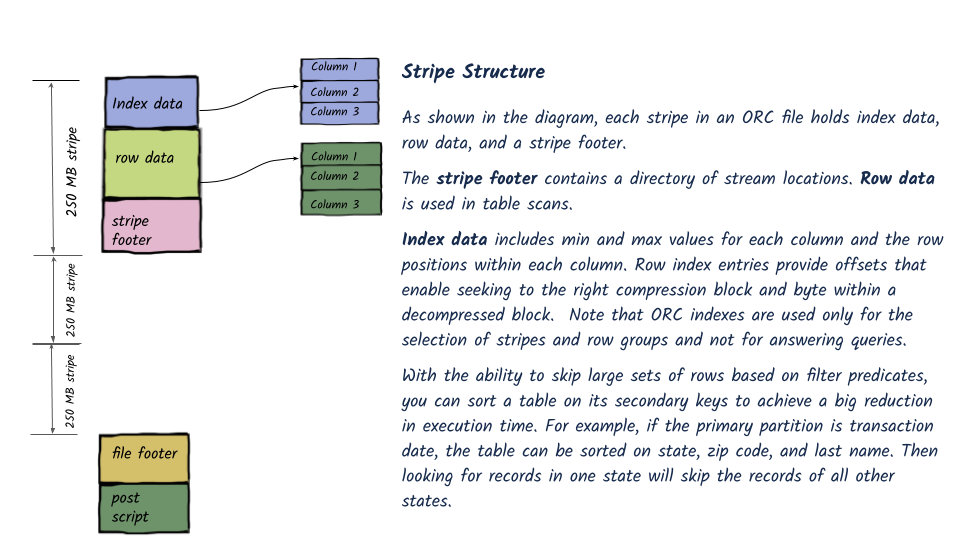

# ORC

## What is ORC?

The _Optimized Row Columnar_ \([ORC](https://orc.apache.org/)\) file format provides a highly efficient way to store Hive data. It was designed to overcome limitations of the other Hive file formats. Using ORC files improves performance when Hive is reading, writing, and processing data

## File Structure

An ORC file contains groups of row data called **stripes**, along with auxiliary information in a **file footer**. At the end of the file a **postscript** holds compression parameters and the size of the compressed footer.

The default stripe size is 250 MB. Large stripe sizes enable large, efficient reads from HDFS.

The file footer contains a list of stripes in the file, the number of rows per stripe, and each column's data type. It also contains column-level aggregates count, min, max, and sum.

This diagram illustrates the ORC file structure



## When to use ORC file format?

When working with Hive data. Hive performs best with ORC.                                                                         Supports Full ACID transactions                                                                                                                        

## 1. Input

#### [https://github.com/ngdeepak/TurnTwistSwingSpin-Analytic-data-workloads-using-Apache-Spark/tree/master/resources/data/orc/sample.orc](https://github.com/ngdeepak/TurnTwistSwingSpin-Analytic-data-workloads-using-Apache-Spark/tree/master/resources/data/orc/sample.orc)

## 2. Code

```python
df = spark.read.orc("/home/deepak/Documents/jupyter/data/orc/sample.orc")
df.show()
```

## 3. Output

```python
+---+----+
|age|name|
+---+----+
| 60|John|
| 30|Tony|
| 40|Mike|
+---+----+
```

