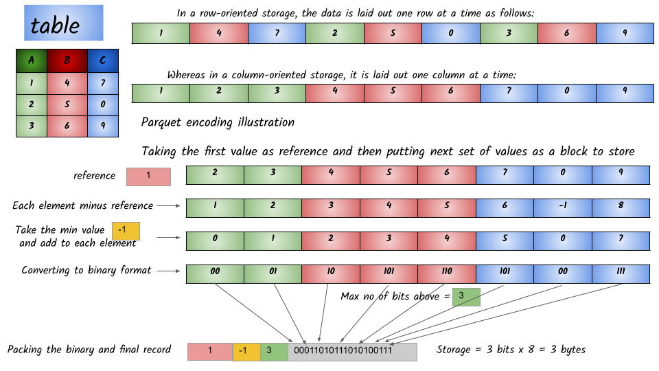

# Parquet

## What is Parquet file?

**Parquet**, an open source **file** format for Hadoop. **Parquet** stores nested data structures in a flat columnar format. Compared to a traditional approach where data is stored in row-oriented approach, **parquet** is more efficient in terms of storage and performance.

Parquet uses the record shredding and assembly algorithm which is superior to simple flattening of nested namespaces. Parquet is optimized to work with complex data in bulk and features different ways for efficient data compression and encoding types.  This approach is best especially for those queries that need to read certain columns from a large table. Parquet can only read the needed columns therefore greatly minimizing the IO.

Example :



### **Advantages of Storing Data in a Columnar Format:**

*  * Organizing by column allows for better compression, as data is more homogenous. The space savings are very noticeable at the scale of a Hadoop cluster.
  * I/O will be reduced as we can efficiently scan only a subset of the columns while reading the data. Better compression also reduces the bandwidth required to read the input.
  * As we store data of the same type in each column, we can use encodings better suited to the modern processors’ pipeline by making instruction branching more predictable.
* Columnar storage like Apache Parquet is designed to bring efficiency compared to row-based files like CSV. When querying, columnar storage you can skip over the non-relevant data very quickly. As a result, aggregation queries are less time consuming compared to row-oriented databases. This way of storage has translated into hardware savings and minimized latency for accessing data.
* The layout of Parquet data files is optimized for queries that process large volumes of data, in the gigabyte range for each individual file.
* Parquet is built to support flexible compression options and efficient encoding schemes. As the data type for each column is quite similar, the compression of each column is straightforward \(which makes queries even faster\). Data can be compressed by using one of the several codecs available; as a result, different data files can be compressed differently.


The following table compares the savings as well as the speedup obtained by converting data into Parquet from CSV.

| Dataset | Size on Amazon S3 | Query Run Time | Data Scanned | Cost |
| :--- | :--- | :--- | :--- | :--- |
| Data stored as CSV files | 1 TB | 236 seconds | 1.15 TB | $5.75 |
| Data stored in Apache Parquet Format | 130 GB | 6.78 seconds | 2.51 GB | $0.01 |
| Savings | 87% less when using Parquet | 34x faster | 99% less data scanned | 99.7% savings |

#### \*\*\*\*

## 1. Input

#### [https://github.com/ngdeepak/TurnTwistSwingSpin-Analytic-data-workloads-using-Apache-Spark/tree/master/resources/data/parquet/sample.parquet](https://github.com/ngdeepak/TurnTwistSwingSpin-Analytic-data-workloads-using-Apache-Spark/tree/master/resources/data/parquet/sample.parquet)

## 2. Code

```text
df = spark.read.parquet("/home/deepak/Documents/jupyter/data/parquet/sample.parquet")
df.show()
```

## 3. Output

```text
+---+----+
|age|name|
+---+----+
| 60|John|
| 30|Tony|
| 40|Mike|
+---+----+
```

